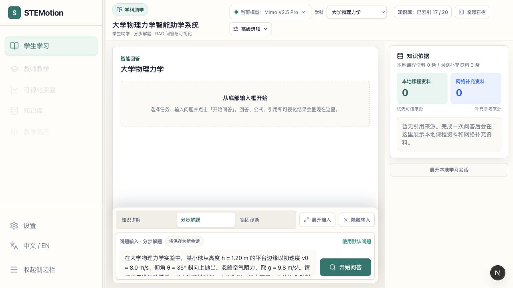
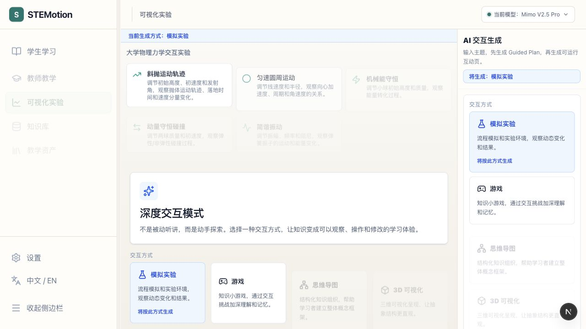
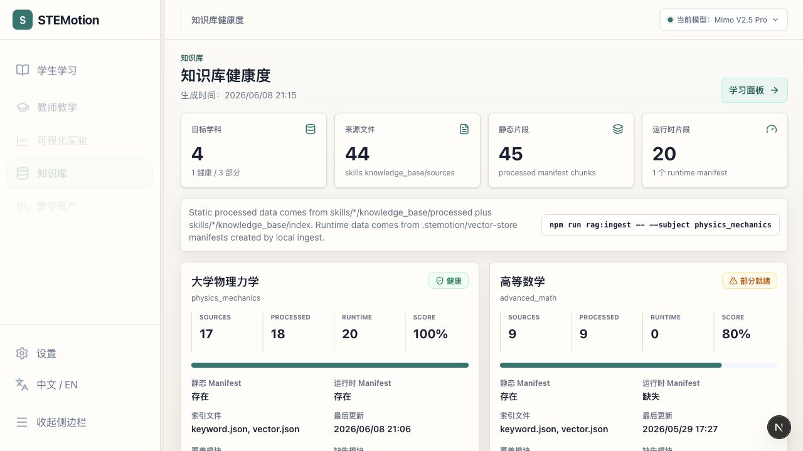
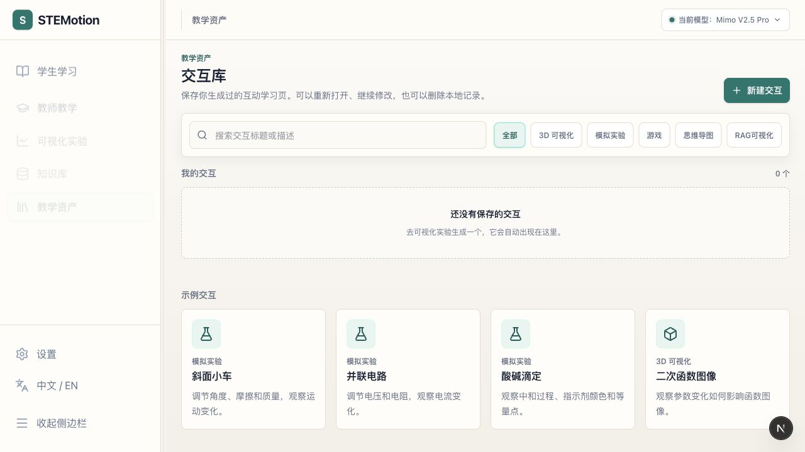
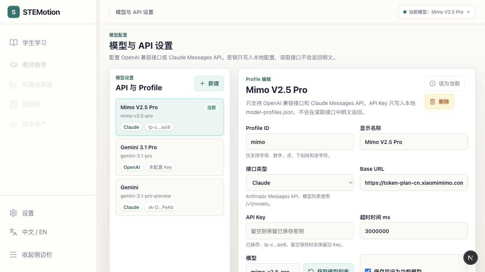
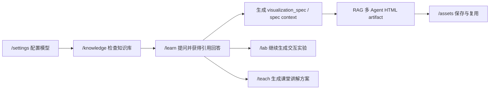
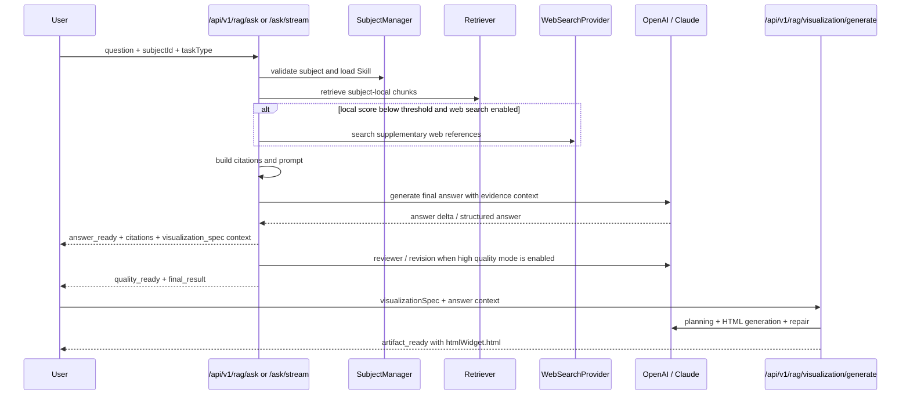

# STEMotion Physics Skill

STEMotion Physics Skill 是面向高校大学物理力学课程的可追溯 RAG 智能助学与助教系统。它以大学物理力学为默认落地学科，结合可切换学科 Skill、课程知识库、本地检索、可选网络补充检索、结构化教学任务和运动过程可视化，支持学生分步学习、错因诊断和教师课堂演示。

原始 STEMotion 系统面向更广泛的 STEM 教育交互实验生成；XH202620 参赛展示版本聚焦高校大学物理力学场景，保留深度交互生成、LearningBlueprint、多 Agent 评审和研究日志能力作为系统底座。



## 评委快速入口

- 参赛展示页：`/learn`（学生学习主入口）
- 教师入口：`/teach`
- 默认学科：大学物理力学 `physics_mechanics`
- 核心场景：学生助学 + 教师助教
- 核心能力：学科 Skill 切换、本地课程知识库检索、网络补充检索、可追溯引用来源、分步解题、错因诊断、教师备课、斜抛运动轨迹可视化
- 典型测试案例：[docs/evaluation/test_cases.md](docs/evaluation/test_cases.md)
- 赛题匹配说明：[docs/xh202620_mapping.md](docs/xh202620_mapping.md)
- 知识库来源说明：[docs/knowledge_sources.md](docs/knowledge_sources.md)
- 重构迁移总览：[docs/restructure_migration_summary.md](docs/restructure_migration_summary.md)（新路由、知识库健康度、RAG -> Lab 桥接和验证入口）
- Round 006 升级验收矩阵：[docs/stemotion_upgrade_acceptance_round006.md](docs/stemotion_upgrade_acceptance_round006.md)（LLM、prompt、reviewer、前端布局、legacy API 和本地验证）
- 3 分钟演示脚本：[docs/demo_script_3min.md](docs/demo_script_3min.md)
- 效果验证报告模板：[docs/evaluation/effect_validation_report.md](docs/evaluation/effect_validation_report.md)
- 参赛提交材料目录：[competition_submission/](competition_submission/)

## XH202620 参赛定位

| 项目 | 内容 |
| --- | --- |
| 作品名称 | STEMotion Physics Skill |
| 默认学科 | 大学物理力学 `physics_mechanics` |
| 核心场景 | 学生助学 + 教师助教 |
| 主要能力 | 学科 Skill、RAG 知识库、引用追溯、结构化解题、错因诊断、教师备课、运动可视化 |
| 技术底座 | Next.js 16、React 19、TypeScript、本地 JSON/TF-IDF 检索、OpenAI / Claude 模型配置 |
| 参赛主线 | 面向一流学科建设的物理力学垂类智能教学应用 |

本版本不把 K-12 综合平台作为主叙事，而是把"高校大学物理力学"做深做清楚：系统先从本地知识库检索依据，再由当前启用的大模型生成最终回答；如果知识库和网络检索没有可靠来源，系统仍由大模型回答，但会明确标注"当前知识库和网络检索中未找到可靠依据"，不会伪造 citation。

## 功能总览

- **学科 Skill 切换**：每个学科拥有独立 `skill.yaml`、system prompt、answer template、知识库路径、检索参数和回答规范。
- **本地知识库优先**：支持 Markdown、TXT、PDF 文档读取和分块索引，不同学科知识库隔离。
- **知识库健康度**：`/knowledge` 页面可视化展示各学科知识库索引状态、源文件数、chunk 数和覆盖范围。
- **网络检索增强**：可选 Mock 或自定义 JSON Search Provider；网络资料只作为补充参考来源。
- **大模型最终回答**：RAG 负责提供依据和上下文，最终回答始终由 active model profile 对应的大模型生成；流式入口会先展示回答，再等待质量审计完成后覆盖保存最终版本。
- **引用追溯**：返回 `citations`、`retrieved_chunks`、`source_summary`，严格区分本地课程资料和网络补充资料。
- **结构化教学任务**：支持知识问答、分步解题、错因诊断、教师备课。
- **RAG 多 Agent 可视化**：RAG 回答可触发题目专属 HTML/SVG/Canvas artifact 生成，流程包含 planning、HTML generation、Safety/Runtime、主动交互诊断、Pedagogy/UX review、Judge 和 Repair；deterministic spec 只作为保真上下文，不作为最终模板。
- **可视化实验**：`/lab` 页面提供交互实验生成（斜抛轨迹、圆周运动、机械能守恒、动量碰撞、简谐振动），支持 Guided Planning、LearningBlueprint 和多 Agent 质量评审。
- **教学资产管理**：`/assets` 页面管理本地交互库，保存、打开、筛选和删除 artifact。
- **模型设置页**：`/settings` 支持 OpenAI 与 Claude 两类接口、Base URL、API Key、模型列表拉取和 active profile 切换。
- **深度交互生成底座**：保留 STEMotion 原有标准实验室、深度交互生成、LearningBlueprint 和多 Agent 质量评审。

## 视觉导览

以下截图来自本地开发服务 `http://localhost:3001`，覆盖评委最容易验证的学生、教师、实验、知识库、教学资产和模型配置入口。

### 学生学习页面

`/learn` 是学生学习主入口，面向评委展示"学科垂类 RAG + 可追溯引用 + 教学任务 + 运动可视化"闭环。页面采用 Codex 式工作台：顶部保留学科与知识库状态，网络检索、快速模式和可视化模式收纳到高级选项，底部常驻问题输入框。


### 教师教学页面

`/teach` 使用同一套学科 RAG 和模型配置，但任务入口切换为课堂备课、演示设计和练习生成；页面同样保留底部 composer 与可折叠辅助信息，适合展示"同一知识库同时服务学生助学与教师助教"。


### 可视化实验页面

`/lab` 承接 RAG 结果或教师输入，生成可运行的交互实验。页面保留 Guided Planning、交互类型选择、AI 交互生成和质量评审面板，适合演示从物理问题到可操作实验的迁移。



### 知识库健康度页面

`/knowledge` 展示每个学科的源文件、静态 processed chunk、运行态 vector-store chunk 和健康状态。它是验收"有没有真的接入本地知识库"的最快入口。



### 教学资产页面

`/assets` 管理已保存的互动学习页，支持按类型筛选、搜索、重新打开和删除本地 artifact。页面已统一到 STEMotion Design Kit，和学习、教学、实验入口保持一致的信息密度与视觉语汇。



### 模型与 API 设置页

`/settings` 用于配置 OpenAI / Claude 兼容模型 profile、API Key、Base URL，并获取模型列表。页面只展示脱敏后的 Key 预览，完整 Key 不会通过读取接口返回；配置列表、表单和接口说明统一使用 STEMotion 面板样式。



## 演示闭环



推荐评审路径：

1. 打开 `/settings`，确认当前 active profile 已配置。
2. 打开 `/knowledge`，确认 `physics_mechanics` 有运行态索引。
3. 打开 `/learn`，使用默认斜抛运动问题运行分步解题。
4. 检查回答中的本地来源 `[Lx]`、证据摘要、质量审计和可视化生成状态。
5. 生成 RAG 互动可视化，确认 start/reset/slider 能改变画面或指标。
6. 需要进一步课堂设计时，跳转 `/lab` 把同一知识点转成可交互实验。

## 系统架构摘要

系统由 Next.js 前端页面、本机 backend generation worker、Route Handlers、Subject Skill 配置、本地 RAG 检索、可选网络补充检索和 OpenAI / Claude 模型调用组成。`/learn` 与 `/teach` 页面负责教学任务交互、流式问答和 RAG 可视化 artifact 展示；`/lab` 继承 deep-interaction 完整交互实验生成；`/knowledge` 展示知识库健康度；`/assets` 管理教学资产。长生成任务优先通过 `/api/v1/generation-jobs` 创建 durable job，由本机 backend 进程继续运行并持久化到 `.stemotion/jobs`，浏览器刷新或 SSE 断开不会自动取消生成；只有显式 cancel 才会 abort。旧版 `/api/v1/rag/ask`、`/api/v1/rag/ask/stream`、`/api/v1/rag/visualization/generate` 和 `/api/v1/deep-interaction/generate` 仍作为兼容入口保留。

详细架构图、RAG 流程、Skill 切换机制、RAG 引用规则、可视化流程和 deep-interaction 关系见 [docs/system_architecture.md](docs/system_architecture.md)。

### 工程架构升级

当前工程采用本机前后端分离的模块化单体：Next.js 负责 UI 与 BFF proxy，本机 backend server 默认运行在 `127.0.0.1:3101`，承接 RAG ask、RAG 可视化和 deep interaction 长任务。`src/app` 只保留页面和 Route Handler，核心业务通过 `src/features/*/application` 暴露应用服务，`src/backend` 放置本机 API/worker/job store，`src/platform` 放置 HTTP/error/proxy 等平台能力，`src/shared` 放置跨功能共享类型。新增 `/api/v1/*` 是内部和前端优先使用的版本化 REST API；旧 `/api/*` 在一个版本周期内作为兼容入口。

## 技术栈

| 层级 | 技术 |
| --- | --- |
| 应用框架 | Next.js `16.2.6` App Router |
| UI | React `19.2.4`、Tailwind CSS v4、lucide-react、framer-motion |
| 语言 | TypeScript |
| 模型接口 | OpenAI Chat Completions 兼容接口、Anthropic Claude Messages API |
| 本地检索 | JSON 文件索引 + TF-IDF / cosine scoring |
| 文档加载 | Markdown、TXT、PDF 可替换解析 |
| 测试 | Node test runner + tsx |
| 本地存储 | `.stemotion/` 运行态目录、`model-profiles.json` 本地模型配置 |

## 快速开始

### 1. 安装依赖

```bash
npm install
```

### 2. 配置模型

复制示例配置：

```bash
cp model-profiles.example.json model-profiles.json
```

Windows PowerShell 可使用：

```powershell
Copy-Item model-profiles.example.json model-profiles.json
```

然后在 `model-profiles.json` 中填入自己的 API Key，或启动项目后打开 `/settings` 页面配置。

示例结构如下，示例 Key 不可直接使用：

```jsonc
{
  "activeProfile": "openai-main",
  "profiles": {
    "openai-main": {
      "label": "OpenAI Main",
      "provider": "openai",
      "baseURL": "https://api.openai.com/v1",
      "apiKey": "YOUR_OPENAI_API_KEY",
      "model": "gpt-4.1",
      "timeout": 300000
    },
    "claude-main": {
      "label": "Claude Main",
      "provider": "anthropic",
      "baseURL": "https://api.anthropic.com",
      "apiKey": "YOUR_CLAUDE_API_KEY",
      "model": "claude-opus-4-1",
      "timeout": 300000
    }
  }
}
```

### 3. 构建知识库索引

```bash
npm run rag:ingest -- --subject all
```

也可以只构建默认学科：

```bash
npm run rag:ingest -- --subject physics_mechanics
```

索引产物写入 `.stemotion/vector-store/`，该目录是本地运行态，不提交到 Git。

### 4. 启动本机前后端

推荐一键启动本机 backend worker 和 Next.js 前端：

```bash
npm run dev:local
```

也可以分两个终端启动，便于单独观察 backend generation job 日志：

```bash
npm run dev:api
npm run dev:web
```

默认端口：

- backend API / worker：`http://127.0.0.1:3101`
- Next.js 前端：`http://localhost:3001`

只运行 `npm run dev` 仍会启动旧的单前端开发服务器，但 durable generation job 需要 `npm run dev:api` 同时运行。后端未启动时，前端长生成入口会返回明确的 `503` 提示。

环境变量可覆盖本机 backend：

```bash
STEMOTION_API_BASE_URL=http://127.0.0.1:3101
STEMOTION_API_PORT=3101
STEMOTION_JOBS_DIR=.stemotion/jobs
```

```bash
npm run dev
```

默认地址：

- `http://localhost:3001/learn` — 学生学习
- `http://localhost:3001/teach` — 教师教学
- `http://localhost:3001/lab` — 可视化实验
- `http://localhost:3001/knowledge` — 知识库健康度
- `http://localhost:3001/assets` — 教学资产
- `http://localhost:3001/settings` — 模型与 API 设置

### 5. 命令行测试 RAG

```bash
npm run rag:query -- --subject physics_mechanics --task step_solution --question "斜抛运动最大高度公式是什么"
```

## 页面入口

| 页面 | 说明 |
| --- | --- |
| `/learn` | 学生学习：知识讲解、分步解题、错因诊断 |
| `/teach` | 教师教学：课堂备课、演示设计、练习生成 |
| `/lab` | 可视化实验：交互实验生成（斜抛轨迹、圆周运动、机械能守恒、动量碰撞、简谐振动） |
| `/knowledge` | 知识库健康度：各学科索引状态、源文件和 chunk 覆盖 |
| `/assets` | 教学资产：本地交互库，保存、打开、筛选和删除 artifact |
| `/settings` | 模型与 API 设置：OpenAI / Claude 模型 profile、API Key、Base URL |
| `/student` | 旧链接兼容入口，重定向到 `/learn` |
| `/teacher` | 旧链接兼容入口，重定向到 `/teach` |
| `/visualization` | 旧链接兼容入口，重定向到 `/lab` |
| `/rag` | 旧链接兼容入口，重定向到 `/learn` |
| `/interactions` | 旧链接兼容入口，重定向到 `/assets` |
| `/deep-interaction` | 深度交互生成（高级能力，不在主导航展示） |
| `/` | 标准实验室模式（高级能力，不在主导航展示） |

## RAG 知识库覆盖范围

| 学科 | 状态 | 源文件数 | Chunk 数 | 覆盖模块 |
| --- | --- | --- | --- | --- |
| `physics_mechanics` | 完整 v1 | 17 | 18 | 矢量、运动学、牛顿定律、摩擦、圆周运动、功与能、动量、转动、振动、实验、误区、题库、演示 |
| `advanced_math` | 轻量 v1 | 9 | 9 | 极限、导数、函数图像、积分、级数、微分方程、误区、题库 |
| `computer_science` | 轻量 v1 | 9 | 9 | 栈队列、表达式求值、递归分治、图算法、最短路径、复杂度、常见Bug、题库 |
| `chemistry` | 轻量 v1 | 9 | 9 | 化学平衡、酸碱平衡、弱酸pH、缓冲滴定、热化学、实验安全、误区、题库 |

构建索引：

```bash
npm run rag:build
```

命令行测试检索：

```bash
npm run rag:query -- --subject physics_mechanics --question "非零初始高度斜抛运动如何求落地时间？"
npm run rag:query -- --subject advanced_math --question "如何分析 f(x)=xe^{-x^2} 的单调性？"
npm run rag:query -- --subject computer_science --question "栈如何用于中缀表达式求值？"
npm run rag:query -- --subject chemistry --question "弱酸pH计算中如何判断近似条件？"
```

## 学科 Skill

所有学科配置位于 `skills/{subject}/`。

```text
skills/
├── physics_mechanics/
│   ├── skill.yaml
│   ├── system_prompt.md
│   ├── answer_template.md
│   └── knowledge_base/
├── advanced_math/
├── chemistry/
└── computer_science/
```

初始学科：

| Skill | 显示名 | 当前用途 |
| --- | --- | --- |
| `physics_mechanics` | 大学物理力学 | 默认深度落地学科，参赛展示主线 |
| `advanced_math` | 高等数学 | 预留可扩展学科 |
| `chemistry` | 大学化学 | 预留可扩展学科 |
| `computer_science` | 程序设计与数据结构 | 预留可扩展学科 |

每个 `skill.yaml` 至少包含：

```yaml
name: physics_mechanics
display_name: 大学物理力学
description: 面向大学物理力学的学科 Skill
default_language: zh-CN
knowledge_base_path: knowledge_base
system_prompt_path: system_prompt.md
answer_template_path: answer_template.md
retrieval:
  top_k: 4
  score_threshold: 0.18
  enable_web_search: true
  web_top_k: 3
tools:
  - formula_reasoning
  - unit_check
  - visualization_parameters
answer_requirements:
  - 分步推导
  - 物理量定义
  - 公式适用条件
  - 单位检查
  - 引用来源
```

添加新学科时，复制任一现有学科目录，修改 `skill.yaml`、prompt、answer template，并把文档放入对应 `knowledge_base/`，然后运行：

```bash
npm run rag:ingest -- --subject your_subject_name
```

## RAG 工作流



关键原则：

- RAG 只负责检索依据、组织上下文和标注来源。
- 最终回答始终由当前 active model profile 对应的大模型生成。
- 本地课程资料是优先可信来源。
- 网络检索资料只能作为补充参考来源。
- 无可靠来源时仍调用大模型，但必须明确说明依据不足，不生成虚假 citations。
- 模型不可用时，`/api/v1/rag/ask` 返回错误，提示检查 `/settings` 模型配置或 API Key。
- 流式入口先把可读回答展示出来，随后继续执行 reviewer、revision 和质量报告。
- RAG 可视化默认走多 Agent HTML artifact 生成；deterministic spec 只作为 `specContext` 保真输入，不直接渲染成最终页面。
- 可视化 artifact 必须通过 Safety、Runtime、Active Interaction Diagnostics、Pedagogy/UX evaluator、Judge 和 Repair 链路，按钮/滑块只发送 ACK 或 console log 不会通过。

## 任务类型

RAG 工作台支持四类教学任务，其中 `/learn` 暴露知识问答、分步解题和错因诊断，`/teach` 暴露教师备课相关任务：

| task_type | 中文名 | 用途 |
| --- | --- | --- |
| `knowledge_qa` | 知识问答 | 概念解释、公式含义、学习建议 |
| `step_solution` | 分步解题 | 已知量提取、模型判断、推导、结果和易错点 |
| `misconception_diagnosis` | 错因诊断 | 分析学生错误答案、纠正思路和巩固练习 |
| `teacher_prep` | 教师备课 | 教学目标、课堂导入、板书推导和互动提问 |

如果请求不传 `task_type`，默认使用 `step_solution`。

## API 摘要

以下示例来自本地开发服务的 smoke call，用于说明接口返回的是可验证结构，而不是前端静态文案。模型 profile 接口只展示脱敏摘要，不返回完整 API Key。

```bash
curl http://localhost:3001/api/v1/subjects
```

```json
{
  "defaultSubject": "physics_mechanics",
  "defaultSubjectDisplayName": "大学物理力学",
  "subjects": [
    {
      "name": "physics_mechanics",
      "display_name": "大学物理力学",
      "knowledge_status": {
        "indexed": true,
        "file_count": 17,
        "chunk_count": 20
      }
    }
  ]
}
```

```bash
curl http://localhost:3001/api/v1/subjects/default
```

```json
{
  "subject": "physics_mechanics",
  "displayName": "大学物理力学",
  "source": "built-in"
}
```

```bash
curl http://localhost:3001/api/v1/model-profiles
```

```json
{
  "activeProfile": "your-active-profile",
  "profiles": [
    {
      "id": "openai-main",
      "label": "OpenAI Main",
      "provider": "openai",
      "model": "gpt-4.1",
      "hasApiKey": true,
      "apiKeyPreview": "sk-...abcd"
    }
  ]
}
```

### 学科与 RAG

| 方法 | 路径 | 说明 |
| --- | --- | --- |
| `GET` | `/api/v1/subjects` | 获取可用学科 Skill、知识库状态、工具和回答规范 |
| `GET` | `/api/v1/subjects/default` | 获取默认学科 |
| `PATCH` | `/api/v1/subjects/default` | 设置默认学科 |
| `POST` | `/api/v1/rag/ask` | 执行学科 RAG 问答，返回结构化回答、引用来源、证据包、复核报告和可视化提示 |
| `POST` | `/api/v1/rag/ask/stream` | SSE 流式问答，按 `progress -> answer_ready -> quality_ready -> final_result` 推送 |
| `POST` | `/api/v1/rag/visualization/generate` | SSE 生成 RAG 互动可视化 artifact，输出通过审计的 `htmlWidget.html` |

### Generation Job API

长生成任务优先走本机 backend job API。Next.js 同源 route 会代理到 `STEMOTION_API_BASE_URL`，默认 `http://127.0.0.1:3101`。

| 方法 | 路径 | 说明 |
| --- | --- | --- |
| `POST` | `/api/v1/generation-jobs` | 创建 durable generation job，支持 `rag_ask_stream`、`rag_visualization`、`deep_interaction` |
| `GET` | `/api/v1/generation-jobs/{jobId}` | 读取 job 状态、结果、错误和脱敏输入摘要 |
| `GET` | `/api/v1/generation-jobs/{jobId}/events` | SSE replay 历史事件并订阅后续事件 |
| `POST` | `/api/v1/generation-jobs/{jobId}/cancel` | 显式取消 job，并 abort 后端生成信号 |

SSE 订阅的第一个事件是：

```json
{ "type": "job_created", "jobId": "job_xxx", "status": "queued" }
```

后续事件保留原生成链路事件，例如 `answer_delta`、`answer_ready`、`quality_ready`、`artifact_ready`、`job_completed`。浏览器关闭或刷新只会断开订阅，不会取消 backend job。

`POST /api/v1/rag/ask` 请求示例：

```json
{
  "question": "一个小球以20m/s初速度、30度角斜抛，求最大高度和射程",
  "subjectId": "physics_mechanics",
  "taskType": "step_solution",
  "retrieval": { "useWebSearch": true },
  "quality": { "mode": "highQuality" }
}
```

响应核心字段：

```json
{
  "subject": { "id": "physics_mechanics", "displayName": "大学物理力学" },
  "taskType": "step_solution",
  "answer": {
    "protocol": "json",
    "text": "...",
    "sections": [],
    "formulas": [],
    "finalResults": []
  },
  "visualizationHint": {
    "type": "projectile_motion",
    "parameters": {
      "v0": 20,
      "angle_deg": 30,
      "g": 9.8
    }
  },
  "visualizationSpec": {
    "type": "projectile_motion",
    "title": "斜抛运动可视化",
    "parameters": {
      "v0": 20,
      "angle_deg": 30,
      "g": 9.8
    }
  },
  "citations": [],
  "evidence": { "chunks": [], "sourceSummary": { "local_count": 0, "web_count": 0 } },
  "retrievalReport": {},
  "qualityReport": {}
}
```

`POST /api/v1/rag/visualization/generate` 接收 RAG 回答、公式、最终结果和 `visualizationSpec`。该 spec 不会被直接套模板渲染，而是压缩为 compact spec context 后进入 planning/html prompt。最终 `artifact_ready` 事件必须包含：

```json
{
  "type": "artifact_ready",
  "artifact": {
    "type": "rag_visualization",
    "status": "ready",
    "schema": {
      "type": "rag_visualization",
      "visualizationSpec": { "type": "interactive_html" },
      "htmlWidget": {
        "widgetType": "rag_visualization",
        "html": "<!DOCTYPE html>..."
      }
    }
  }
}
```

### 模型配置

| 方法 | 路径 | 说明 |
| --- | --- | --- |
| `GET` | `/api/v1/model-profiles` | 读取脱敏后的模型 profile 摘要 |
| `POST` | `/api/v1/model-profiles` | 新建或更新模型 profile |
| `PATCH` | `/api/v1/model-profiles` | 切换当前 active profile |
| `DELETE` | `/api/v1/model-profiles/{id}` | 删除模型 profile |
| `POST` | `/api/v1/model-profiles/models` | 使用表单中的 API Key 获取 OpenAI 或 Claude 模型列表 |

`GET /api/v1/model-profiles` 不返回完整 API Key，只返回 `hasApiKey` 和 `apiKeyPreview`。

### 深度交互生成

| 方法 | 路径 | 说明 |
| --- | --- | --- |
| `POST` | `/api/generate` | 标准实验室一次性生成 |
| `POST` | `/api/v1/deep-interaction/planning` | 深度交互生成前的澄清与教师计划 |
| `POST` | `/api/v1/deep-interaction/generate` | 深度交互 SSE 生成 |
| `POST` | `/api/v1/deep-interaction/follow-up` | 基于当前 HTML 的追问修改 |

## 网络检索配置

网络检索是可选增强能力，由环境变量和学科配置共同控制。

| 变量 | 说明 |
| --- | --- |
| `STEMOTION_WEB_SEARCH_PROVIDER=mock` | 使用 MockWebSearchProvider，适合测试和演示 |
| `STEMOTION_WEB_SEARCH_PROVIDER=custom-json` | 使用自定义 JSON 搜索接口 |
| `STEMOTION_WEB_SEARCH_ENDPOINT` | 自定义搜索 API 地址 |
| `STEMOTION_WEB_SEARCH_API_KEY` | 自定义搜索 API Key |

没有真实搜索 API Key 时，系统会优雅降级，不影响本地 RAG、模型回答和页面加载。网络结果在 UI 和 citations 中始终标记为"网络补充资料"，不会伪装成本地课程资料。

## 目录结构

```text
stemotion-mvp/
├── src/
│   ├── app/
│   │   ├── api/
│   │   │   ├── v1/
│   │   │   ├── rag/                 # legacy adapter
│   │   │   ├── subjects/            # legacy adapter
│   │   │   └── model-profiles/      # legacy adapter
│   │   ├── learn/                   # 学生学习主入口
│   │   ├── teach/                   # 教师教学主入口
│   │   ├── lab/                     # 可视化实验
│   │   ├── knowledge/               # 知识库健康度
│   │   ├── assets/                  # 教学资产管理
│   │   ├── settings/                # 模型与 API 设置
│   │   ├── deep-interaction/
│   │   └── ...
│   ├── features/
│   │   ├── rag/                     # RAG 核心逻辑
│   │   ├── subjects/                # 学科 Skill 管理
│   │   ├── settings/                # 模型配置管理
│   │   ├── deep-interaction/        # 深度交互生成
│   │   ├── knowledge/               # 知识库健康度
│   │   ├── assets/                  # 教学资产管理
│   │   └── rag-lab-bridge/          # RAG -> Lab 桥接
│   ├── platform/
│   ├── shared/
│   ├── components/
│   │   ├── rag/
│   │   ├── settings/
│   │   └── layout/
│   └── lib/
│       ├── rag/
│       ├── subjects/
│       ├── generation/
│       └── config/
├── skills/
│   ├── physics_mechanics/
│   ├── advanced_math/
│   ├── chemistry/
│   └── computer_science/
├── scripts/
│   ├── ingest_knowledge.ts
│   ├── build_knowledge.ts
│   ├── eval_rag.ts
│   ├── migrate_knowledge_base.ts
│   ├── test_rag_query.ts
│   └── spike-export-pptx.ts
├── tests/                           # 55 个测试文件
├── docs/
│   ├── assets/readme/
│   ├── evaluation/
│   ├── superpowers/plans/
│   ├── restructure_round*.md        # 13 轮重构审计记录
│   └── ...
├── competition_submission/
└── model-profiles.example.json
```

## 常用脚本

| 命令 | 用途 |
| --- | --- |
| `npm run dev` | 启动开发服务器，默认端口 `3001` |
| `npm run build` | 构建生产版本 |
| `npm run start` | 启动生产构建 |
| `npm run lint` | ESLint 检查 |
| `npm run typecheck` | TypeScript 类型检查 |
| `npm run check` | 依次运行 lint、typecheck、build |
| `npm test` | 运行单元/API/浏览器布局测试（55 个测试文件） |
| `npm run test:contracts` | 运行核心接口、prompt、RAG 可视化和布局契约测试 |
| `npm run test:layout` | 运行 Playwright 视口布局 smoke |
| `npm run test:static-smoke` | 构建后运行静态路由契约 smoke；不启动浏览器、不调用真实 RAG 查询或 Deep Interaction 生成 |
| `npm run rag:ingest -- --subject all` | 构建全部学科知识库索引 |
| `npm run rag:build` | 构建知识库索引 |
| `npm run rag:eval` | 运行 RAG 评估 |
| `npm run rag:migrate` | 迁移知识库 schema |
| `npm run rag:query -- --subject physics_mechanics --question "..."` | 命令行测试 RAG |
| `npm run spike:export-pptx` | PowerPoint 导出实验脚本 |

Python 包装脚本也保留：

```bash
python scripts/ingest_knowledge.py --subject all
python scripts/test_rag_query.py --subject physics_mechanics --question "斜抛运动最大高度公式是什么"
```

## 测试与验收

推荐提交前运行：

```bash
npm run test:contracts
npm run typecheck
npm run lint
npm run build
npm run test:layout
```

`npm run test:static-smoke` 会先执行构建，再运行 `tests/test_static_route_contract.ts`；该静态检查不会启动浏览器、不会调用真实 RAG 查询，也不会触发 Deep Interaction 生成。

重点验收场景：

1. `/settings` 可以新增 OpenAI / Claude profile，获取模型列表并切换 active profile。
2. `/learn` 默认学科为大学物理力学，旧路由 `/student`、`/rag` 会重定向到 `/learn`。
3. 斜抛运动问题能返回结构化分步解题、引用来源、质量报告和可作为 spec context 的 `visualization_spec`。
4. RAG 可视化生成必须产出 `htmlWidget.html`，并通过安全、运行时、主动交互和多 Agent 审计；start/reset/slider 至少一种操作会改变可见画面或指标。
5. 无可靠来源时，仍由模型回答，但明确提示依据不足，不伪造 citations。
6. 切换到高等数学、大学化学、程序设计与数据结构时，检索不会混用其他学科知识库。
7. 模型配置错误时，RAG API 返回明确错误，前端不展示检索片段拼接成的假回答。
8. 典型案例 demo fallback 只用于演示兜底，并明确标注"演示样例结果"。

## XH202620 相关文档

| 文档 | 用途 |
| --- | --- |
| [docs/system_architecture.md](docs/system_architecture.md) | 系统架构、RAG 流程、引用和可视化说明 |
| [docs/feature_architecture.md](docs/feature_architecture.md) | 功能分级与主导航页面信息架构 |
| [docs/system_function_guide.md](docs/system_function_guide.md) | 系统功能使用指南 |
| [docs/progress_design.md](docs/progress_design.md) | 进度与演进设计 |
| [docs/xh202620_mapping.md](docs/xh202620_mapping.md) | 赛题目标理解与评审指标映射 |
| [docs/rag_subject_switching.md](docs/rag_subject_switching.md) | 学科 Skill 与 RAG 使用说明 |
| [docs/knowledge_sources.md](docs/knowledge_sources.md) | 知识库来源、网络补充资料边界和合规说明 |
| [docs/evaluation/test_cases.md](docs/evaluation/test_cases.md) | 典型测试案例总览 |
| [docs/evaluation/rag_metrics.md](docs/evaluation/rag_metrics.md) | RAG 效果评估指标模板 |
| [docs/evaluation/results/](docs/evaluation/results/) | 真实案例输出记录模板 |
| [docs/evaluation/user_feedback_summary.md](docs/evaluation/user_feedback_summary.md) | 用户反馈汇总模板 |
| [docs/evaluation/effect_validation_report.md](docs/evaluation/effect_validation_report.md) | 效果验证报告模板 |
| [docs/demo_stability.md](docs/demo_stability.md) | Demo 稳定性与 fallback 边界说明 |
| [docs/demo_script_3min.md](docs/demo_script_3min.md) | 3 分钟参赛演示脚本 |
| [docs/safety_ethics_statement.md](docs/safety_ethics_statement.md) | 安全与伦理合规声明 |
| [docs/todo_before_submission.md](docs/todo_before_submission.md) | 参赛提交前人工补齐清单 |
| [docs/restructure_migration_summary.md](docs/restructure_migration_summary.md) | 重构迁移总览 |
| [competition_submission/](competition_submission/) | 参赛提交材料目录模板 |

注意：用户反馈、效果验证报告、报名材料、签字盖章材料均为模板或目录说明，不包含伪造数据。真实学生/教师反馈和最终提交材料需要团队后续补充。

## 深度交互与研究底座

STEMotion 原有深度交互能力仍然保留，用于支撑"RAG 解释 + 物理过程可视化 + 教师可用交互实验"的长期方向。

```text
Clarification
-> Teacher Plan
-> Approval
-> LearningBlueprint
-> Subject Schema
-> Verified Template / Free Generation
-> Multi-Agent Quality Review
-> Explainable QualityReport
-> Follow-up Refinement
```

底座能力包括：

- 标准实验室模式 `/`：加载传统 `ExperimentConfig`，快速展示单个结构化实验。
- 深度交互模式 `/deep-interaction`：通过 Guided Planning 和 Agent pipeline 生成 HTML/SVG/Canvas 交互组件。
- 教学资产管理 `/assets`：保存、打开、筛选和删除 artifact。
- Guided Planning：生成前澄清需求，输出教师可读计划，用户批准后再生成。
- LearningBlueprint：记录主题、学科、年级、Bloom 层级、核心变量、expectedInsight、学习目标和知识约束。
- Subject Schema Validator：对高频 STEM 主题注入学科约束，并把校验摘要进入生成上下文。
- Verified Experiment Templates：对常见主题优先匹配原创可信模板，再做 slot-based customization。
- Multi-Agent Feedback Loop：Pedagogy、UX、Safety、Runtime Evaluator 共同评审，JudgeAgent 决定是否触发 RepairAgent。
- Explainable QualityReport：展示蓝图对齐、变量覆盖、知识约束、模板保留和 repair trace。
- Follow-up 修改：基于当前 HTML 创建新版本，尽量保留 blueprint、模板约束和稳定 `data-role`。
- Research Mode：本地记录摘要事件并导出 JSON/CSV，用于后续教师-AI 共创研究。

更多设计文档：

- [docs/design.md](docs/design.md)
- [docs/prompt-lifecycle.md](docs/prompt-lifecycle.md)
- [docs/deep-interaction-refactor-plan.md](docs/deep-interaction-refactor-plan.md)
- [docs/data-flow-trace-example.md](docs/data-flow-trace-example.md)

## 安全与合规

- 不提交真实 API Key、`.env.local`、`model-profiles.json`、`.stemotion/`、`.next/` 或本地 vector-store 产物。
- 不使用未经脱敏的真实学生隐私数据。
- 不伪造学术数据、用户反馈、效果验证结果、报名表或盖章材料。
- AI 生成内容仅供学习参考，重要教学结论需结合课程教材与教师要求核验。
- 本地课程资料是优先可信来源；网络检索资料只作为补充参考来源。
- 如果没有可靠依据，系统必须明确说明依据不足，不编造文献、页码或课程来源。

## 部署注意事项

- 本项目默认适合本地 demo、课程原型和比赛展示。
- 生产部署时需要单独处理模型 API Key 的安全存储，不建议把 `model-profiles.json` 明文部署到公开服务器。
- `.stemotion/` 是运行态目录，包含本地索引、截图和日志，不应作为源代码提交。
- 若部署到云端，建议把向量索引、搜索 API Key、模型 Key 迁移到服务端安全配置或托管密钥服务。

## 版本方向

当前 `1.2.0` 目标是 XH202620 参赛展示版：

- 做深大学物理力学默认 Skill。
- 保持高等数学、大学化学、程序设计与数据结构的可切换配置。
- 强化可追溯 RAG、结构化教学任务、流式回答、多 Agent 质量审计和题目专属互动可视化。
- 保留深度交互生成作为 STEMotion 与普通 RAG 问答系统的差异化能力。

后续可扩展方向：

- 接入更权威的课程讲义、教材授权资料和教师自建知识库。
- 替换本地 JSON/TF-IDF 为 Chroma、FAISS 或托管向量数据库。
- 接入真实 Bing、SerpAPI、Tavily 或学校内部搜索服务。
- 为圆周运动、简谐振动、动量守恒等模型增加更多可复用 spec context 与题目专属 HTML artifact 生成策略。
- 增加教师/学生真实使用反馈和效果验证报告。
