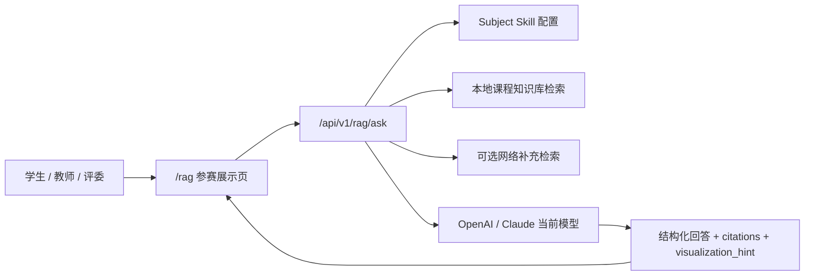
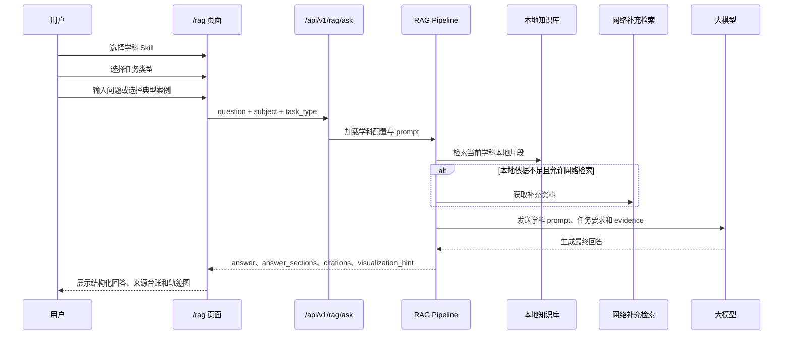
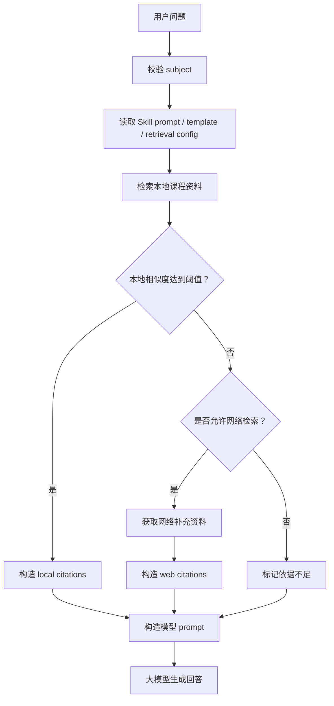
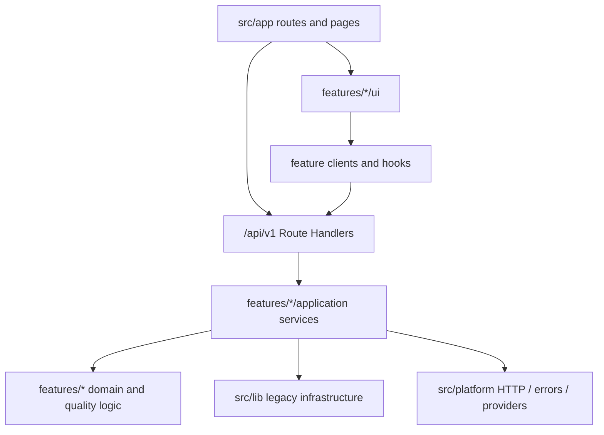

# STEMotion XH202620 系统架构

本文说明 STEMotion Physics Skill 在 XH202620 参赛展示版中的系统结构。当前版本聚焦高校大学物理力学课程，以 `/rag` 页面作为主展示入口，原 STEMotion 深度交互生成能力作为底座和后续扩展能力保留。

## 1. 总体架构说明

STEMotion Physics Skill 面向大学物理力学教学场景，将学科配置、课程知识库、检索增强生成、引用追溯和运动可视化串联成一个助学与助教工作流。学生可以用它完成分步解题、概念问答和错因诊断；教师可以用它生成课堂演示方案、互动提问和可视化参数。



## 2. `/rag` 参赛展示页流程

`/rag` 页面强调“学科垂类 RAG + 可追溯引用 + 教学任务 + 运动可视化”。用户先选择学科 Skill 和任务类型，再输入问题或选择典型案例。系统检索当前学科知识库，必要时补充网络检索，最终由当前启用的大模型生成结构化回答。



## 3. 学科 Skill 切换机制

每个学科目录包含独立配置，物理只是默认学科，不被硬编码为唯一学科。

```text
skills/{subject}/
├── skill.yaml
├── system_prompt.md
├── answer_template.md
└── knowledge_base/
```

每个 Skill 至少包含：

- `skill.yaml` 或等价配置：学科名称、显示名、知识库路径、检索配置、工具配置和回答规范。
- `system_prompt.md`：学科身份、回答边界和安全要求。
- `answer_template.md`：当前学科的结构化回答模板。
- `knowledge_base/`：Markdown、TXT、PDF 等本地课程资料。
- `retrieval config`：`top_k`、`score_threshold`、是否允许网络检索、网络结果数量。
- `tools`：例如公式推导、单位检查、运动可视化参数。
- `answer requirements`：例如分步推导、公式适用条件、引用来源。

## 4. RAG 检索与引用流程

RAG 的职责是提供依据和上下文，最终回答由当前启用的大模型生成。



引用规则：

- 本地课程资料是优先可信来源。
- 网络检索资料只作为补充参考来源。
- citations 必须区分 `source_type: "local"` 和 `source_type: "web"`。
- 不允许把网络来源伪装成本地课程资料。
- 检索不到可靠依据时，应提示“当前知识库和网络检索中未找到可靠依据”，不得编造文献、页码或来源。

## 5. 可视化流程

当问题可识别为斜抛运动时，后端优先返回 `visualization_hint`：

```json
{
  "type": "projectile_motion",
  "parameters": {
    "v0": 20,
    "angle_deg": 30,
    "g": 9.8
  }
}
```

前端读取该提示后，在 `/rag` 页面展示参数卡片，并可渲染页面内 SVG 轨迹图或轻量动画。若后端未返回提示，前端会用轻量规则兜底解析斜抛参数；兜底仅用于展示，不替代课程知识依据。

## 6. 原 STEMotion 深度交互系统与参赛版关系

`/deep-interaction`、LearningBlueprint、多 Agent 评审、Verified Templates 和本地交互库是 STEMotion 的系统底座。它们说明项目不仅能做问答，还具备“AI 生成可交互 STEM 实验”的长期扩展方向。

在 XH202620 参赛展示版中：

- `/rag` 是主流程，聚焦大学物理力学助学与助教。
- deep-interaction 是扩展能力，用于后续把 RAG 解释进一步转化为可交互实验。
- LearningBlueprint 和多 Agent 评审是教学质量控制底座，不作为本次参赛演示的第一入口。

## 7. 工程化模块单体边界

本项目保留一个 Next.js 工程，不拆独立后端，也不引入数据库。工程边界改为：

- `src/app`：只负责页面组合和 Route Handler，不直接拼接业务流程。
- `src/features/*/application`：对外暴露 RAG、Subjects、Settings、Deep Interaction 的应用服务。
- `src/features/*/ui`：承载对应功能页面工作台和可交互组件。
- `src/platform`：封装 HTTP response、统一错误、后续环境变量和服务端基础设施能力。
- `src/shared`：放置跨功能共享 DTO 和纯类型。
- `src/lib`：当前作为 legacy infrastructure 兼容层保留，后续逐步收敛到 feature 内部。



新接口优先使用 `/api/v1/*`，旧 `/api/*` 作为一个版本周期内的 thin adapter 保留，便于外部调用方平滑迁移。
