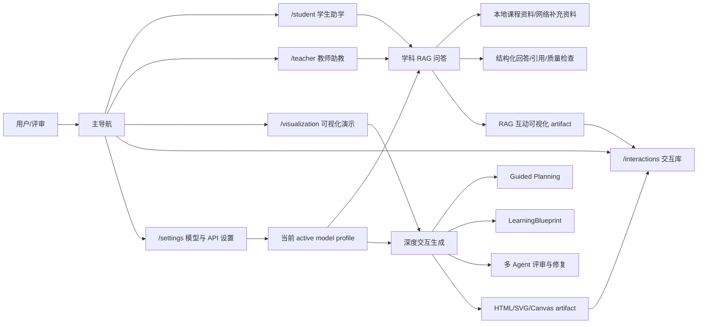
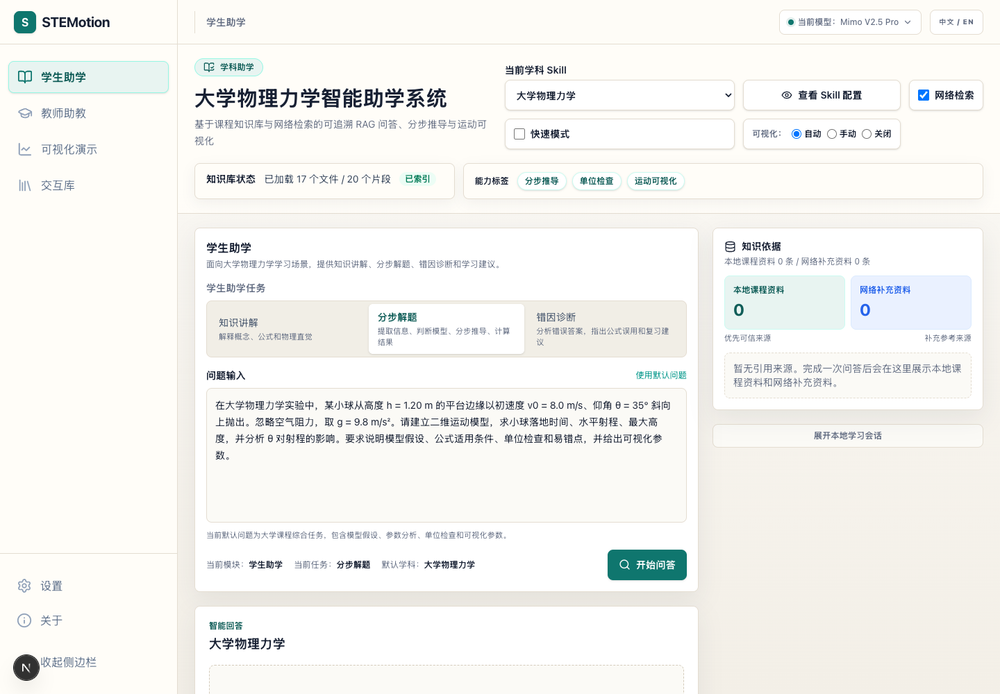
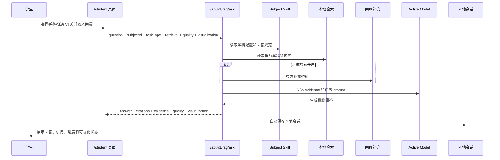
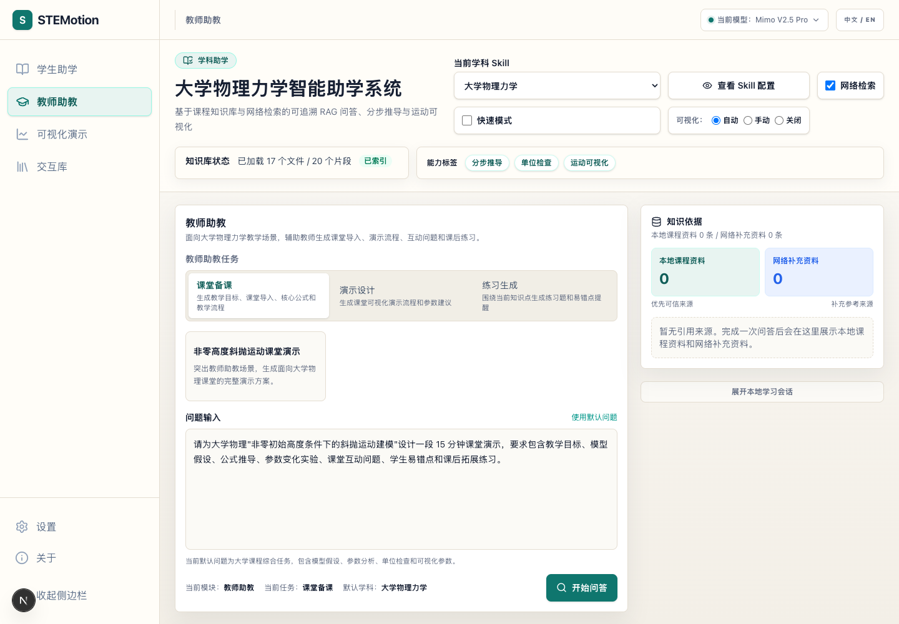
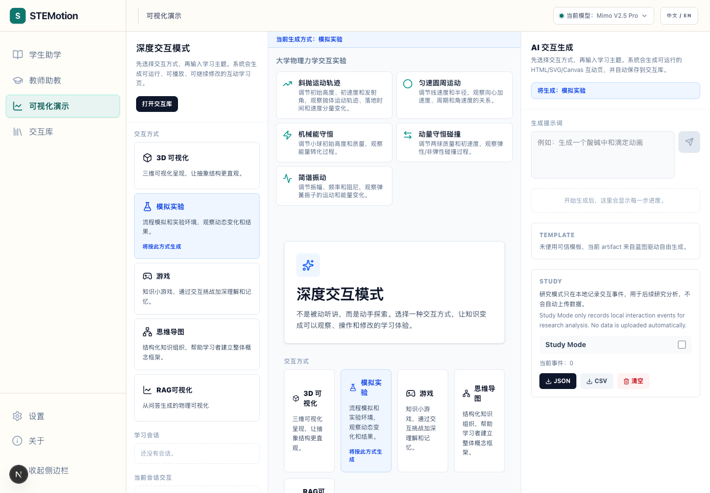
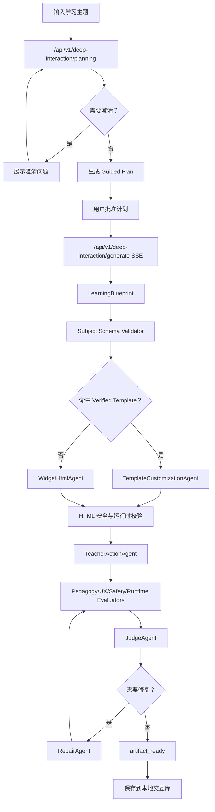
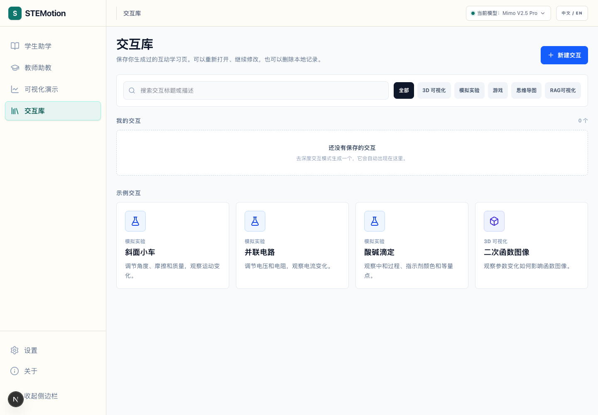
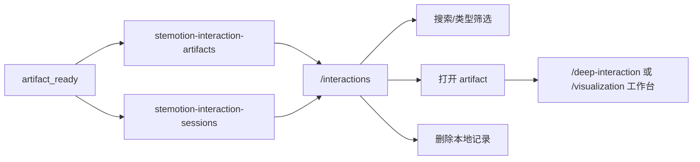
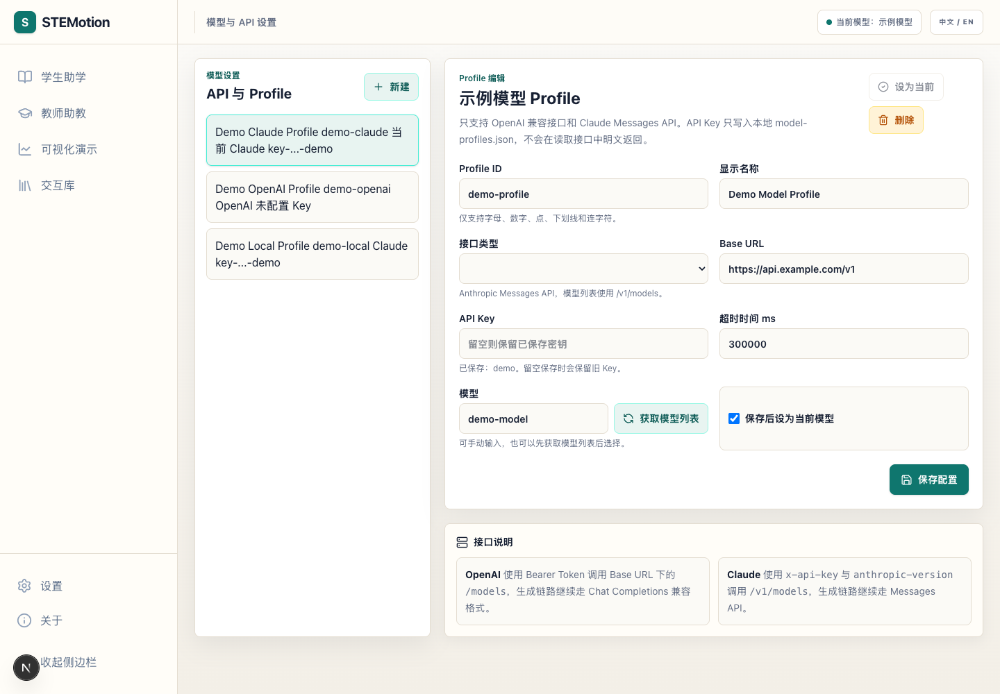

# STEMotion 系统功能文档

> 本文档面向交付、评审与项目交接，基于 2026-06-02 在 `http://localhost:3001` 的代码检查、页面走查、API 验证和测试结果整理。文档重点描述当前真实可用功能与流程，不替代 README、架构文档或代码审计报告。

## 1. 系统定位

STEMotion 是面向大学物理力学教学场景的智能助学与助教系统。当前版本把学科 Skill、课程知识库、本地检索、可选网络补充、结构化 RAG 回答、互动可视化生成和本地交互库串成一个闭环。

核心用户分为三类：

- 学生：用于概念理解、分步解题、错因诊断和可视化辅助学习。
- 教师：用于课堂备课、演示设计、练习生成和互动实验资源共创。
- 评审/交付人员：用于检查系统入口、业务流程、可追溯引用、模型配置和稳定性边界。

系统的主导航入口是 `/student`、`/teacher`、`/visualization`、`/interactions` 和 `/settings`。其中 `/student` 与 `/teacher` 复用 RAG 工作台，但模式、默认问题和任务类型不同；`/visualization` 与 `/deep-interaction` 复用深度交互工作台；`/interactions` 管理本地保存的互动 artifact；`/settings` 管理模型 Profile。



## 2. 页面入口与兼容路由

| 路径 | 当前行为 | 核心功能 |
| --- | --- | --- |
| `/student` | 主入口，返回 200 | 学生助学：知识讲解、分步解题、错因诊断 |
| `/teacher` | 主入口，返回 200 | 教师助教：课堂备课、演示设计、练习生成 |
| `/visualization` | 主入口，返回 200 | 深度交互工作台，生成大学物理力学交互实验 |
| `/interactions` | 主入口，返回 200 | 本地交互库，搜索、筛选、打开、删除 artifact |
| `/settings` | 主入口，返回 200 | OpenAI 兼容接口与 Claude Messages API Profile 管理 |
| `/` | 兼容入口 | 307 重定向到 `/student` |
| `/rag` | 兼容入口 | 重定向到 `/student` |
| `/experiments` | 兼容入口 | 重定向到 `/interactions` |
| `/generate` | 兼容入口 | 重定向到 `/visualization` |
| `/player` | 兼容入口 | 重定向到 `/interactions` |
| `/deep-interaction` | 高级入口 | 与 `/visualization` 使用同一深度交互工作台 |

主导航首屏如下。



## 3. 学生助学流程

`/student` 面向学生学习场景，默认学科是 `physics_mechanics`，显示名为“大学物理力学”。页面顶部提供学科 Skill 选择、Skill 配置查看、网络检索开关、快速模式开关和可视化模式单选。

### 3.1 学科 Skill

页面通过 `GET /api/v1/subjects` 获取可用学科。2026-06-02 实测返回 4 个学科：

- `physics_mechanics`：大学物理力学，当前已索引 17 个文件 / 20 个片段。
- `advanced_math`：高等数学，当前未索引。
- `chemistry`：大学化学，当前未索引。
- `computer_science`：程序设计与数据结构，当前未索引。

学科 Skill 包含学科显示名、简介、检索参数、工具标签、回答规范和知识库状态。学生页默认展示能力标签，例如公式推导、单位检查、运动可视化参数。

### 3.2 任务类型

学生页提供三类任务：

| 任务 | 后端 task type | 用途 |
| --- | --- | --- |
| 知识讲解 | `knowledge_qa` | 解释概念、公式和物理直觉 |
| 分步解题 | `step_solution` | 提取信息、判断模型、分步推导和计算结果 |
| 错因诊断 | `misconception_diagnosis` | 分析错误答案、指出公式误用和复习建议 |

默认问题是大学物理力学综合斜抛题，包含初始高度、初速度、发射角、重力加速度、模型假设、单位检查和可视化参数要求。用户可以修改问题，也可以点击“使用默认问题”恢复默认内容。

### 3.3 检索与生成开关

- 网络检索：默认开启。系统优先使用本地课程资料，网络资料只作为补充参考。
- 快速模式：开启后请求使用 `quality.mode = "fast"`，跳过较重的质量审核；关闭时使用高质量模式。
- 可视化模式：支持 `auto`、`manual`、`off`。
  - `auto`：RAG 回答完成后，由可视化编排器判断是否启动互动可视化 artifact 生成。
  - `manual`：保留可视化提示，不自动生成完整 artifact。
  - `off`：关闭可视化处理。

### 3.4 问答输出

点击“开始问答”后，前端调用 `/api/v1/rag/ask`。页面右侧显示真实进度面板，覆盖问题解析、本地检索、网络补充、结构化回答、引用整理和可视化阶段。回答区展示：

- 回答协议：结构化 JSON 或 Markdown 兜底。
- 结构化结果：如最终数值、单位、引用 ref。
- 公式块：公式、解释和 citation refs。
- 分段回答：模型假设、已知量提取、模型判断、推导、结果、易错点等。
- 质量报告：如果后端返回 `quality_report`，页面展示质量检查结论。
- AI 内容提示：页面固定提示 AI 生成内容仅供学习参考。

### 3.5 引用依据与本地会话

“知识依据”面板区分本地课程资料和网络补充资料。本地引用使用 `L` 编号，网络引用使用 `W` 编号。引用可展开查看原始片段；回答正文中的 citation ref 可以联动定位到右侧来源。

页面还提供“本地学习会话”。完成一次问答后，结果自动保存到浏览器本地 Zustand persist；用户可以恢复、改名、删除或清空最近会话。当前实现说明最近会话仅保存在本机浏览器，不包含 API Key。



## 4. 教师助教流程

`/teacher` 与学生页复用同一个 RAG 工作台，但模式配置不同。页面标题、默认问题和任务卡会切换到教师助教场景。



教师页提供三类任务：

| 任务 | 后端 task type | 用途 |
| --- | --- | --- |
| 课堂备课 | `teacher_prep` | 生成教学目标、课堂导入、核心公式和教学流程 |
| 演示设计 | `teacher_prep` | 生成课堂可视化演示流程和参数建议 |
| 练习生成 | `teacher_prep` | 围绕当前知识点生成练习题和易错点提醒 |

教师页会展示示例任务卡，例如“非零高度斜抛运动课堂演示”。点击示例卡只会填充任务类型和问题，不会自动发起模型请求，避免误触造成额度消耗或现场展示不稳定。教师提交问题后，输出同样包含结构化回答、引用来源、检索片段、质量提示和本地会话保存。

典型教师流程：

1. 选择“课堂备课”“演示设计”或“练习生成”。
2. 使用默认问题或示例任务，也可以输入自定义教学需求。
3. 确认网络检索、快速模式和可视化模式。
4. 点击“开始问答”。
5. 查看结构化教学方案、引用依据、可视化建议和本地会话记录。

## 5. 可视化与深度交互流程

`/visualization` 是深度交互工作台入口。它不是普通聊天页，而是一个生成可运行 HTML/SVG/Canvas 互动学习 artifact 的工作台。



### 5.1 交互类型

页面提供交互方式卡片：

- 3D 可视化：用于三维结构和空间观察。
- 模拟实验：用于实验过程、参数变化和动态结果。
- 游戏：用于知识小游戏和交互挑战。
- 思维导图：用于结构化知识组织。
- RAG 可视化：用于从 RAG 问答生成的物理可视化 artifact 展示与归档。

当前深度交互直接生成接口校验的自由生成类型为 `simulation`、`3d_visualization`、`game` 和 `mind_map`。`rag_visualization` 主要来自 RAG 可视化编排流程，并可保存到交互库。

### 5.2 大学物理力学案例

工作台提供物理力学案例按钮：

- 斜抛运动轨迹。
- 匀速圆周运动。
- 机械能守恒。
- 动量守恒碰撞。
- 简谐振动。

点击案例会把高质量 prompt 填入右侧生成输入框，不会直接生成。用户仍需触发生成并批准 Guided Plan。

### 5.3 Guided Planning 与生成

深度交互生成采用“先规划、后生成”的流程。用户输入主题后，前端先调用 `/api/v1/deep-interaction/planning`。如果需求模糊，系统会要求澄清；如果需求明确，系统生成教师可读计划，用户批准后才调用 `/api/v1/deep-interaction/generate`。

生成接口使用 SSE 返回阶段事件，前端实时更新进度。主要阶段包括：

- 创建会话。
- 选择交互类型。
- 生成交互大纲。
- 生成 LearningBlueprint。
- 学科约束校验。
- 匹配 Verified Template。
- 模板定制或自由生成 HTML。
- 生成教师动作。
- 安全、运行时、教学和 UX 评审。
- Judge 决策。
- RepairAgent 修复。
- artifact ready。



### 5.4 追问修改与研究模式

当当前会话存在 artifact 时，右侧面板展示当前交互摘要、学习目标和“已保存到交互库”状态。用户可以提交 follow-up 修改，前端调用 `/api/v1/deep-interaction/follow-up`，在保留原 blueprint、模板信息和规划元数据的基础上创建新版本。

Study Mode 默认关闭。开启后只记录摘要事件，例如规划开始、澄清回答、计划批准、蓝图生成、模板命中、artifact 生成、质量报告查看、follow-up 提交和 artifact 保存。研究日志可导出 JSON 或 CSV，不自动上传。

## 6. 交互库流程

`/interactions` 用于管理由深度交互或 RAG 可视化流程保存的本地 artifact。



页面功能包括：

- 搜索：按交互标题或描述过滤。
- 类型筛选：全部、3D 可视化、模拟实验、游戏、思维导图、RAG 可视化。
- 我的交互：显示本地保存 artifact 的标题、描述、类型、版本、质量分数和更新时间。
- 打开：恢复对应 session 和 current artifact，跳转到深度交互工作台。
- 删除：从本地 artifact store 和 session store 删除记录。
- 示例交互：斜面小车、并联电路、酸碱滴定、二次函数图像，点击后进入 `/deep-interaction?prompt=...` 并预选交互类型。

交互库使用浏览器本地 Zustand persist。它不是服务端数据库，也没有账号系统。刷新页面后，已持久化的本地 artifact 仍可恢复；换浏览器或清理 localStorage 后不会保留。



## 7. 模型与 API 设置流程

`/settings` 管理模型 Profile。截图已脱敏，模型名、Base URL 和 API Key 预览均替换为示例值，控件结构来自真实运行页面。



### 7.1 Profile 列表

左侧列表展示本地 `model-profiles.json` 中的模型 Profile 摘要。读取接口不会返回完整 API Key，只返回：

- `hasApiKey`：是否存在密钥。
- `apiKeyPreview`：脱敏预览。
- `label`、`provider`、`baseURL`、`model`、`timeout` 等非密钥字段。

顶部模型切换器会读取 `/api/v1/model-profiles`，并通过 `PATCH /api/v1/model-profiles` 切换 active profile。

### 7.2 Profile 编辑

右侧表单支持：

- Profile ID：只允许字母、数字、点、下划线和连字符。
- 显示名称。
- 接口类型：OpenAI 或 Claude。
- Base URL。
- API Key：新建 Profile 必填；编辑已有 Profile 时留空会保留旧 Key。
- 超时时间，单位毫秒。
- 模型：可手动输入，也可使用当前表单中的 API Key 获取模型列表。
- 保存后设为当前模型。

保存时调用 `POST /api/v1/model-profiles`。删除时调用 `DELETE /api/v1/model-profiles/{id}`，且不允许删除唯一 Profile。获取模型列表时：

- OpenAI 兼容接口使用 Bearer Token 调用 Base URL 下的 `/models`。
- Claude 使用 `x-api-key` 和 `anthropic-version` 调用 `/v1/models`。

## 8. API 与数据流

### 8.1 学科与 RAG

| 方法 | 路径 | 用途 |
| --- | --- | --- |
| `GET` | `/api/v1/subjects` | 获取学科 Skill、默认学科、知识库状态、工具和回答规范 |
| `GET` | `/api/v1/subjects/default` | 获取默认学科及来源 |
| `PATCH` | `/api/v1/subjects/default` | 设置默认学科 |
| `POST` | `/api/v1/rag/ask` | 执行 RAG 问答，返回回答、引用、证据、检索报告、质量报告和可视化提示 |

`POST /api/v1/rag/ask` 的核心请求字段：

```json
{
  "question": "什么是牛顿第二定律？",
  "subjectId": "physics_mechanics",
  "taskType": "knowledge_qa",
  "retrieval": { "useWebSearch": false },
  "quality": { "mode": "fast" },
  "visualization": { "mode": "off" }
}
```

核心响应字段：

- `subject`：学科 ID 和显示名。
- `taskType`：任务类型。
- `answer`：协议、全文、结构化 sections、公式块、最终结果。
- `citations`：本地或网络引用。
- `evidence`：检索片段、来源统计和 evidence pack。
- `retrievalReport`：候选数、可靠数、阈值、关键词、是否低依据。
- `qualityReport`：质量检查结果。
- `visualizationHint` / `visualizationSpec`：可视化提示或规格。
- `warnings`：面向前端的告警。

### 8.2 模型配置

| 方法 | 路径 | 用途 |
| --- | --- | --- |
| `GET` | `/api/v1/model-profiles` | 获取脱敏 Profile 摘要 |
| `POST` | `/api/v1/model-profiles` | 新建或更新 Profile |
| `PATCH` | `/api/v1/model-profiles` | 切换 active profile |
| `DELETE` | `/api/v1/model-profiles/{id}` | 删除 Profile |
| `POST` | `/api/v1/model-profiles/models` | 使用表单 API Key 拉取远端模型列表 |

### 8.3 深度交互

| 方法 | 路径 | 用途 |
| --- | --- | --- |
| `POST` | `/api/v1/deep-interaction/planning` | 生成前澄清与 Guided Plan |
| `POST` | `/api/v1/deep-interaction/generate` | SSE 生成互动 artifact |
| `POST` | `/api/v1/deep-interaction/follow-up` | 基于当前 HTML 做追问修改并创建新版本 |
| `POST` | `/api/v1/rag/visualization/generate` | 从 RAG 回答生成互动可视化 artifact |

## 9. 实测结果

实测时间：2026-06-02 14:21 CST。运行环境为本地 Next.js 开发服务器，端口 `3001`。

### 9.1 自动化测试

| 命令 | 结果 |
| --- | --- |
| `npm test` | 143 个测试全部通过 |
| `npm run typecheck` | 通过 |
| `npm run lint` | 通过 |

测试覆盖包括 API v1 契约、架构边界、citation refs、公式渲染、模型 Profile 脱敏、RAG 多 Agent、RAG session、本地 artifact 持久化、RAG 可视化、HTML widget 合约、SubjectManager、错误归因和可视化规格校验。

### 9.2 HTTP 页面烟测

| 路径 | 实测结果 |
| --- | --- |
| `/student` | 200 |
| `/teacher` | 200 |
| `/visualization` | 200 |
| `/interactions` | 200 |
| `/settings` | 200 |
| `/` | 307，重定向到 `/student` |

### 9.3 API 验证

`GET /api/v1/subjects` 实测结果：

- 返回 4 个学科。
- 默认学科为 `physics_mechanics`。
- 大学物理力学知识库已索引，`file_count = 17`，`chunk_count = 20`。

`POST /api/v1/rag/ask` 实测条件：

- 问题：`什么是牛顿第二定律？`
- 学科：`physics_mechanics`
- 任务：`knowledge_qa`
- 网络检索：关闭。
- 质量模式：快速。
- 可视化：关闭。

实测返回：

- 学科显示名：大学物理力学。
- 回答协议：Markdown fallback。
- 结构化段落：4 段。
- citation：1 条本地来源，0 条网络来源。
- 本地资料统计：1 条。
- warnings：0 条。

### 9.4 浏览器走查

使用 `agent-browser` 进行页面走查。当前机器没有可用 Chrome/Chromium 缓存，实际使用 Microsoft Edge 可执行文件：

```bash
npx agent-browser --executable-path '/Applications/Microsoft Edge.app/Contents/MacOS/Microsoft Edge' set viewport 1440 1000
```

浏览器走查确认以下控件存在并可见：

- 主导航：学生助学、教师助教、可视化演示、交互库、设置。
- 顶部控制：模型切换器、中文/英文切换。
- RAG 工作台：学科 Skill 下拉、查看 Skill 配置、网络检索、快速模式、可视化模式、任务卡、问题输入、开始问答、知识依据、本地学习会话。
- 深度交互工作台：交互类型卡、大学物理力学案例、AI 交互生成输入、Guided Planning 面板、Study Mode。
- 交互库：搜索、类型筛选、我的交互、示例交互、新建交互。
- 模型设置：Profile 列表、新建、设为当前、删除、Profile 表单、获取模型列表、保存配置。

## 10. 使用边界与注意事项

- AI 生成内容仅供学习参考，重要教学结论需要结合课程教材和教师要求核验。
- 本地课程资料是优先可信来源；网络检索资料只能作为补充参考来源。
- 当知识库和网络检索没有可靠依据时，系统应提示依据不足，不编造引用、页码或课程来源。
- 模型配置保存在本地 `model-profiles.json`，读取接口不会返回完整 API Key。
- 交互库和学习会话保存在浏览器 localStorage/Zustand persist 中，不是服务端数据库。
- 当前系统没有账号体系，也不会自动上传研究日志。
- `/visualization` 的深度交互自由生成支持 `simulation`、`3d_visualization`、`game`、`mind_map`；RAG 可视化 artifact 主要由 RAG 可视化编排器生成后进入交互库。
- 设置页截图已脱敏，文档中不包含本机真实模型 Profile、Base URL 或 API Key。
- 现有 README 中部分知识库统计可能来自较早运行状态；本文档以 2026-06-02 `GET /api/v1/subjects` 返回的 17 个文件 / 20 个片段为准。

